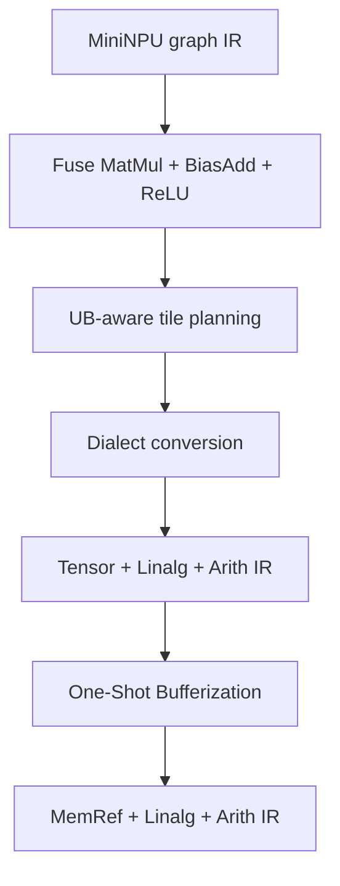

# MiniNPU Compiler

[中文说明](README_CN.md) · [Quick start](QUICKSTART_CN.md) ·
[Verified results](docs/verification.md)

MiniNPU Compiler is an educational out-of-tree MLIR compiler for learning the
core workflow of an NPU compiler: defining a target dialect, validating tensor
semantics, rewriting graph patterns, planning tiles under on-chip memory
constraints, lowering target operations to upstream structured MLIR, and
materializing tensor values as owned MemRef buffers.

The project is intentionally small enough to read end to end. It demonstrates
compiler mechanisms and an explicit educational cost model; it does not claim
to reproduce a proprietary NPU compiler or generate production device code.

## Pipeline



| Stage | Main implementation | Result |
| --- | --- | --- |
| Driver | standalone `mininpu-opt` | upstream and custom passes in one tool |
| Dialect | ODS/TableGen plus C++ verifiers | `matmul`, `bias_add`, `relu`, fused op |
| Fusion | `OpRewritePattern` | safe 3-to-1 fusion with single-use guards |
| Planning | UB-capacity search and cost model | deterministic M/N/K tile metadata |
| Lowering | MLIR dialect conversion | Tensor/Linalg/Arith with no MiniNPU ops |
| Bufferization | One-Shot Bufferize and ownership deallocation | tensor-free MemRef/Linalg IR |

## Verified results

The full v0-v5 suite was built and executed with LLVM/MLIR 18.1.3 on Ubuntu
24.04 x86-64.

For `M=128`, `K=256`, `N=512`, `f32`:

| UB capacity | Selected tile `(M,N,K)` | Working set | Estimated tile count |
| ---: | ---: | ---: | ---: |
| 64 KiB | `(48,48,48)` | 55,488 B | 198 |
| 256 KiB | `(112,96,96)` | 246,144 B | 36 |

The suite also verifies invalid MatMul shapes, shared-intermediate fusion
safety, fusion and lowering idempotence, an impossible 128-byte UB target,
dynamic-shape planning fallback, metadata preservation, and rejection of an
incorrect lowering pipeline. See [the verification report](docs/verification.md)
and the checked-in IR evidence under `docs/evidence/`.

## Build

Required environment:

- Ubuntu 24.04 x86-64
- LLVM, Clang and MLIR 18.1.3
- CMake 3.28+, Ninja 1.11+, Python 3
- about 4 GiB RAM; the build script uses two parallel jobs

```bash
chmod +x scripts/*.sh
bash scripts/01_build.sh
bash scripts/run_v5.sh
```

Or run the compiler pipeline directly:

```bash
build/bin/mininpu-opt test/lowering.mlir \
  '--pass-pipeline=builtin.module(mininpu-fuse-linear-relu,mininpu-plan-tiles,mininpu-lower-to-linalg)'
```

## Key files

- `include/MiniNPU/Dialect/MiniNPU/`: dialect and operation definitions;
- `lib/Dialect/MiniNPU/`: dialect initialization and semantic verifiers;
- `lib/Transforms/FuseMatMulBiasRelu.cpp`: graph fusion;
- `lib/Transforms/PlanTiles.cpp`: UB-aware tile selection;
- `lib/Transforms/LowerToLinalg.cpp`: structured-MLIR lowering;
- `scripts/07_test_bufferization.sh`: tensor-to-MemRef ownership regression;
- `test/`: positive, negative, safety and capacity cases;
- `scripts/`: reproducible build and regression entry points.

## Current boundary

The tile planner uses a documented educational UB model. v5 reaches bufferized
MemRef/Linalg/Arith IR, not executable LLVM IR or NPU machine code. Loop/vector
lowering, runtime ABI integration, target instruction selection and hardware
benchmarking remain future work. A local buffer is deallocated in the v5 test;
buffers returned across a function boundary must be owned by the caller.

## License

Apache License 2.0. LLVM/MLIR attribution is documented in
`THIRD_PARTY_NOTICES.md`.
