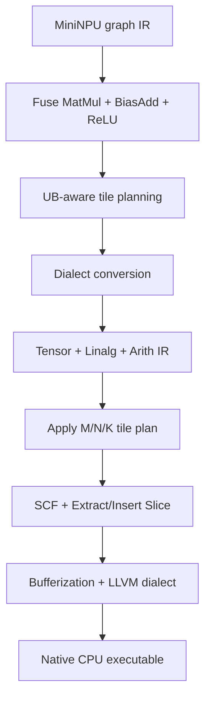

# MiniNPU Compiler

[中文说明](README_CN.md) · [Quick start](QUICKSTART_CN.md) ·
[Verified results](docs/verification.md)

MiniNPU Compiler is an educational out-of-tree MLIR compiler for learning the
core workflow of an NPU compiler: defining a target dialect, validating tensor
semantics, rewriting graph patterns, planning tiles under on-chip memory
constraints, lowering target operations to upstream structured MLIR, and
materializing tensor values as owned MemRef buffers. The v7 pipeline applies
the selected M/N/K schedule as boundary-safe SCF loops and tensor slices, then
continues through the LLVM dialect to a numerically checked host executable.

The project is intentionally small enough to read end to end. It demonstrates
compiler mechanisms and an explicit educational cost model; it does not claim
to reproduce a proprietary NPU compiler or generate production device code.

## Pipeline


```mermaid
flowchart TD
    A["MiniNPU graph IR"] --> B["Fuse MatMul + BiasAdd + ReLU"]
    B --> C["UB-aware tile planning"]
    C --> D["Dialect conversion"]
    D --> E["Tensor + Linalg + Arith IR"]
    E --> F["Apply M/N/K tile plan"]
    F --> G["SCF + Extract/Insert Slice"]
    G --> H["Bufferization + LLVM dialect"]
    H --> I["Native CPU executable"]
```

| Stage | Main implementation | Result |
| --- | --- | --- |
| Driver | standalone `mininpu-opt` | upstream and custom passes in one tool |
| Dialect | ODS/TableGen plus C++ verifiers | `matmul`, `bias_add`, `relu`, fused op |
| Fusion | `OpRewritePattern` | safe 3-to-1 fusion with single-use guards |
| Planning | UB-capacity search and cost model | deterministic M/N/K tile metadata |
| Lowering | MLIR dialect conversion | standalone or fused ops fully legalized to Tensor/Linalg/Arith |
| Scheduling | Linalg tiling driven by planned attributes | boundary-safe SCF loops and tensor slices |
| Bufferization | One-Shot Bufferize and ownership deallocation | tensor-free MemRef/Linalg IR |
| Host code generation | Linalg-to-SCF and progressive LLVM lowering | linked executable with four checked outputs |

## Verified results

The full v0-v7 suite is designed for LLVM/MLIR 18 on Ubuntu
24.04 x86-64.

For `M=128`, `K=256`, `N=512`, `f32`:

| UB capacity | Selected tile `(M,N,K)` | Working set | Estimated tile count |
| ---: | ---: | ---: | ---: |
| 64 KiB | `(48,48,48)` | 55,488 B | 198 |
| 256 KiB | `(112,96,96)` | 246,144 B | 36 |

The suite also verifies invalid MatMul shapes, shared-intermediate fusion
safety, standalone and fused lowering, lowering idempotence, an impossible
128-byte UB target, dynamic-shape planning fallback and rejection, and
metadata preservation. See [the verification report](docs/verification.md)
and the checked-in IR evidence under `docs/evidence/`.

## Build

Required environment:

- Ubuntu 24.04 x86-64
- LLVM, Clang and MLIR 18.1.3
- CMake 3.28+, Ninja 1.11+, Python 3
- about 4 GiB RAM; the build script uses two parallel jobs

```bash
chmod +x scripts/*.sh
bash scripts/setup_ubuntu_24_04.sh
bash scripts/run_v7.sh
```

Or run the compiler pipeline directly:

```bash
build/bin/mininpu-opt test/lowering.mlir \
  '--pass-pipeline=builtin.module(mininpu-fuse-linear-relu,mininpu-plan-tiles,mininpu-lower-to-linalg,mininpu-apply-tiles)'
```

## Key files

- `include/MiniNPU/Dialect/MiniNPU/`: dialect and operation definitions;
- `lib/Dialect/MiniNPU/`: dialect initialization and semantic verifiers;
- `lib/Transforms/FuseMatMulBiasRelu.cpp`: graph fusion;
- `lib/Transforms/PlanTiles.cpp`: UB-aware tile selection;
- `lib/Transforms/LowerToLinalg.cpp`: composable lowering for MatMul, BiasAdd, ReLU and the fused operation;
- `lib/Transforms/ApplyTiles.cpp`: cost-model-driven Linalg/SCF tile materialization;
- `scripts/07_test_bufferization.sh`: tensor-to-MemRef ownership regression;
- `scripts/08_test_cpu_execution.sh`: SCF/LLVM lowering and native execution;
- `scripts/09_test_applied_tiling.sh`: scheduled IR, idempotence and malformed-plan regression;
- `runtime/check_f32.c`: minimal numerical-checking runtime ABI;
- `test/`: positive, negative, safety and capacity cases;
- `scripts/`: reproducible build and regression entry points.

## Current boundary

The tile planner uses a documented educational UB model. v7 produces LLVM IR
and a native executable for the host CPU. It does not generate NPU machine code.
Vectorization, proprietary device runtime integration, target instruction
selection and NPU hardware benchmarking remain future work.

## License

Apache License 2.0. LLVM/MLIR attribution is documented in
`THIRD_PARTY_NOTICES.md`.
