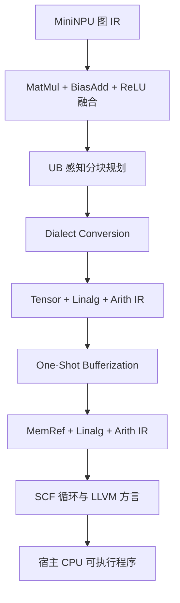

# MiniNPU Compiler：面向 NPU 编译器学习的 MLIR 项目

[English](README.md) · [快速开始](QUICKSTART_CN.md) ·
[验证报告](docs/verification.md) · [简历写法](docs/resume_cn.md) ·
[项目面试题](docs/interview_defense_cn.md) ·
[GitHub 发布](docs/github_publish_cn.md)

MiniNPU Compiler 是一个基于 LLVM/MLIR 18 的小型、可完整阅读的编译器项目，
覆盖 NPU 编译器常见主链路：自定义 Dialect、算子语义校验、图融合、片上
UB 容量约束下的分块规划、向 Tensor/Linalg/Arith 标准方言 Lowering，以及
One-Shot Bufferization 与局部缓冲区所有权回收。
v6 进一步把 Linalg 物化为显式循环，Lowering 到 LLVM 方言和 LLVM IR，
并链接为经过数值校验的 x86-64 本机程序。

本项目用于展示编译器机制和可解释的教育型代价模型，不声称复现商业 NPU
编译器，也不声称已经生成真实 NPU 指令。

## 编译流程



| 阶段 | 核心实现 | 验证点 |
| --- | --- | --- |
| v0 | 独立 `mininpu-opt` 驱动 | IR 解析打印、常量折叠 |
| v1 | ODS/TableGen 自定义 Dialect | 算子注册、形状与类型校验 |
| v2 | `OpRewritePattern` 图融合 | 单用户保护、幂等性、共享值负例 |
| v3 | UB 约束分块搜索 | 容量约束、代价函数、动态形状回退 |
| v4 | Dialect Conversion | 完全消除 MiniNPU 算子并保留分块元数据 |
| v5 | One-Shot Bufferization | 消除 Tensor，生成 MemRef 并回收局部缓冲区 |
| v6 | SCF/LLVM Lowering 与运行时 ABI | 生成并执行宿主程序，校验 4 个输出元素 |

## 实测结果

项目面向 Ubuntu 24.04 x86-64、LLVM/MLIR 18.1.3 环境执行 v0-v6
全量回归。对于 `M=128、K=256、N=512、f32`：

| UB 容量 | 分块 `(M,N,K)` | 工作集 | 估算 Tile 数 |
| ---: | ---: | ---: | ---: |
| 64 KiB | `(48,48,48)` | 55,488 B | 198 |
| 256 KiB | `(112,96,96)` | 246,144 B | 36 |

Lowering 后得到：

```text
tensor.empty
  -> linalg.fill
  -> linalg.matmul
  -> linalg.generic(bias broadcast + arith.addf + arith.maximumf)
```

详细数据见 [验证报告](docs/verification.md)，实际生成的 IR 位于
`docs/evidence/`。

## 构建与测试

```bash
chmod +x scripts/*.sh
bash scripts/01_build.sh
bash scripts/run_v6.sh
```

直接运行完整 Pass Pipeline：

```bash
build/bin/mininpu-opt test/lowering.mlir \
  '--pass-pipeline=builtin.module(mininpu-fuse-linear-relu,mininpu-plan-tiles,mininpu-lower-to-linalg)'
```

## 核心目录

- `include/MiniNPU/Dialect/MiniNPU/`：Dialect、ODS 算子定义；
- `lib/Dialect/MiniNPU/`：Dialect 初始化和算子 Verifier；
- `lib/Transforms/FuseMatMulBiasRelu.cpp`：融合 Pass；
- `lib/Transforms/PlanTiles.cpp`：UB 感知分块 Pass；
- `lib/Transforms/LowerToLinalg.cpp`：标准方言 Lowering；
- `scripts/07_test_bufferization.sh`：Tensor 到 MemRef 及所有权回归；
- `scripts/08_test_cpu_execution.sh`：循环/LLVM Lowering 与宿主执行回归；
- `runtime/check_f32.c`：最小数值校验运行时 ABI；
- `test/`：正常、异常、安全性和容量边界测试；
- `scripts/`：可复现构建与回归入口。

## 能力边界

分块模型是公开、可解释的教育型模型；v6 生成的是宿主 x86-64 LLVM IR 和
本机程序，而不是 NPU 机器码。向量化、设备运行时、目标指令选择和 NPU
硬件性能评测仍属于后续工作。
