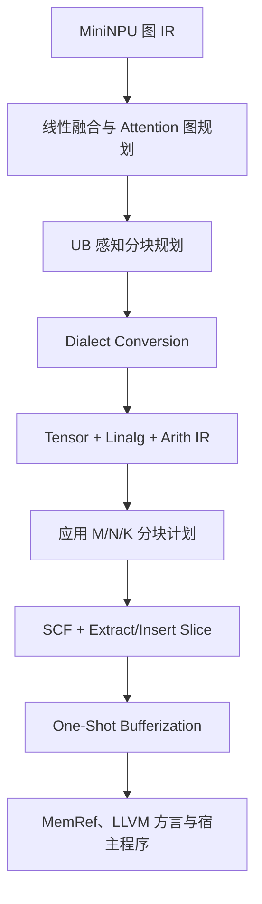

# MiniNPU Compiler：面向 NPU 编译器学习的 MLIR 项目

[English](README.md) · [快速开始](QUICKSTART_CN.md) ·
[验证报告](docs/verification.md) · [简历写法](docs/resume_cn.md) ·
[项目面试题](docs/interview_defense_cn.md) ·
[GitHub 发布](docs/github_publish_cn.md)

MiniNPU Compiler 是一个基于 LLVM/MLIR 18 的小型、可完整阅读的编译器项目，
覆盖 NPU 编译器常见主链路：自定义 Dialect、算子语义校验、图融合、片上
UB 容量约束下的分块规划、向 Tensor/Linalg/Arith 标准方言 Lowering，以及
One-Shot Bufferization 与局部缓冲区所有权回收。
v6 进一步把 Linalg 物化为显式循环，Lowering 到 LLVM 方言和 LLVM IR，
并链接为经过数值校验的 x86-64 本机程序。v7 将 UB 代价模型选择的
M/N/K 分块实际物化为带边界处理的 SCF 循环与 Tensor 切片。v8 增加广播
BatchMatMul、数值稳定 Softmax 和 FP32 累积 RMSNorm；v9 识别
QK-Softmax-PV-RMSNorm 子图，基于 use-def 关系规划安全融合边界，并完成整图
LLVM Lowering 与本机数值验证。

本项目用于展示编译器机制和可解释的教育型代价模型，不声称复现商业 NPU
编译器，也不声称已经生成真实 NPU 指令。

## 编译流程


```mermaid
flowchart TD
    A["MiniNPU 图 IR"] --> B["线性融合与 Attention 图规划"]
    B --> C["UB 感知分块规划"]
    C --> D["Dialect Conversion"]
    D --> E["Tensor + Linalg + Arith IR"]
    E --> F["应用 M/N/K 分块计划"]
    F --> G["SCF + Extract/Insert Slice"]
    G --> H["One-Shot Bufferization"]
    H --> I["MemRef、LLVM 方言与宿主程序"]
```

| 阶段 | 核心实现 | 验证点 |
| --- | --- | --- |
| v0 | 独立 `mininpu-opt` 驱动 | IR 解析打印、常量折叠 |
| v1 | ODS/TableGen 自定义 Dialect | 算子注册、形状与类型校验 |
| v2 | `OpRewritePattern` 图融合 | 单用户保护、幂等性、共享值负例 |
| v3 | UB 约束分块搜索 | 容量约束、代价函数、动态形状回退 |
| v4 | Dialect Conversion | 独立或融合算子均可完全合法化，并保留分块元数据 |
| v5 | One-Shot Bufferization | 消除 Tensor，生成 MemRef 并回收局部缓冲区 |
| v6 | SCF/LLVM Lowering 与运行时 ABI | 生成并执行宿主程序，校验 4 个输出元素 |
| v7 | 代价模型驱动的真实分块 | 生成边界安全的三层 SCF 循环与 Tensor 切片，验证幂等性和错误诊断 |
| v8 | 多算子结构化 Lowering | 广播 BatchMatMul、稳定 Softmax、FP32 累积 RMSNorm 及本机数值验证 |
| v9 | Attention 跨算子规划 | 识别 QK-Softmax-PV-RMSNorm，分析共享值边界与中间张量流量，执行整图 LLVM 回归 |

## 实测结果

项目面向 Ubuntu 24.04 x86-64、LLVM/MLIR 18 环境执行 v0-v9
全量回归。对于 `M=128、K=256、N=512、f32`：

| UB 容量 | 分块 `(M,N,K)` | 工作集 | 估算 Tile 数 |
| ---: | ---: | ---: | ---: |
| 64 KiB | `(48,48,48)` | 55,488 B | 198 |
| 256 KiB | `(112,96,96)` | 246,144 B | 36 |

Lowering 后得到：

```text
tensor.empty
  -> linalg.fill
  -> linalg.matmul
  -> linalg.generic(bias broadcast + arith.addf + arith.maximumf)
```

详细数据见 [验证报告](docs/verification.md)，实际生成的 IR 位于
`docs/evidence/`。

## 构建与测试

```bash
chmod +x scripts/*.sh
bash scripts/setup_ubuntu_24_04.sh
bash scripts/run_v9.sh
```

直接运行完整 Pass Pipeline：

```bash
build/bin/mininpu-opt test/lowering.mlir \
  '--pass-pipeline=builtin.module(mininpu-fuse-linear-relu,mininpu-plan-tiles,mininpu-lower-to-linalg,mininpu-apply-tiles)'
```

## 核心目录

- `include/MiniNPU/Dialect/MiniNPU/`：Dialect、ODS 算子定义；
- `lib/Dialect/MiniNPU/`：Dialect 初始化和算子 Verifier；
- `lib/Transforms/FuseMatMulBiasRelu.cpp`：融合 Pass；
- `lib/Transforms/PlanTiles.cpp`：UB 感知分块 Pass；
- `lib/Transforms/PlanAttention.cpp`：Attention 子图识别、共享值分析和融合边界规划；
- `lib/Transforms/LowerToLinalg.cpp`：线性算子及 Attention 相关算子的组合式 Lowering；
- `lib/Transforms/ApplyTiles.cpp`：将 M/N/K 计划物化为 SCF 循环和边界切片；
- `scripts/07_test_bufferization.sh`：Tensor 到 MemRef 及所有权回归；
- `scripts/08_test_cpu_execution.sh`：循环/LLVM Lowering 与宿主执行回归；
- `scripts/09_test_applied_tiling.sh`：真实分块、幂等性和不完整计划负例；
- `scripts/13_test_attention_pipeline.sh`：跨算子规划与整图本机执行回归；
- `docs/wsl_setup_cn.md`：WSL 进入、依赖安装与构建说明；
- `runtime/check_f32.c`：最小数值校验运行时 ABI；
- `test/`：正常、异常、安全性和容量边界测试；
- `scripts/`：可复现构建与回归入口。

## 能力边界

分块及 Attention 规划是公开、可解释的教育型模型；v9 标记融合候选与安全
物化边界，但尚未生成单体融合 Attention 内核。当前生成的是宿主 x86-64
LLVM IR 和本机程序，而不是 NPU 机器码。向量化、设备运行时、目标指令选择
和 NPU 硬件性能评测仍属于后续工作。
